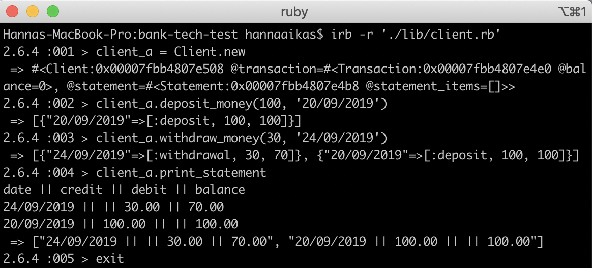

# Bank Tech Test
* Purpose: Tech test completed in 1 day. Aim to demonstrate good TDD process and application of OO principles.
* Current status of project: Acceptance criteria / user requirements met (see below for details)
* To be completed next: (1) Refactor (mocking in tests); (2) Add more tests for edge cases (eg. incorrect user inputs); (3) Consider splitting out a controller (e.g. app.rb) vs leaving current structure; (4) Seek feedback from product owner (e.g. see below for assumptions made).

## Approach Taken
* Tech Stack: Ruby, RSpec for testing, SimpleCov for test coverage, Rubocop linter.
### Assumptions made:
* App should allow us to create instances of client, so that it could be used for several clients.
* Spec did not mention providing any confirmation messages back to client after each transaction, could build these in later if required.
* Edge cases - guard against client withdrawing more than their balance.
* Unhappy paths - check that user inputs a valid date, in format 'DD/MM/YYYY'.
### Structured code into several classes:
* Client - creates instances of client, also acts as a de facto controller (seek feedback on whether this should be split out into separate controller e.g. app.rb).
* Transaction - keeps record of bank balance and handles transactions i.e. deposits and withdrawals.
* Statement - keeps record of transactions and is able to produce a statement showing these.
### Testing:
* Feature test is from user perspective and simulates key interactions - create new user, deposit, withdraw, print statement
* Unit tests focus on specific classes and methods as well as identified edge case.

## Instructions - How to Test the App
* Clone this repo onto your computer.
* Navigate into the folder e.g. `cd bank-tech-test`
* Run `bundle install` to install dependencies
* To run tests, run Rspec on your terminal: `rspec` which will show test results and SimpleCov test coverage stat
* To run the linter, run Rubocop on your terminal: `rubocop`

## Instructions - How to Use the App
* Follow above instructions to: clone the repo, navigate to folder, run bundle install
* Open IRB on your Terminal and require the client file: `irb -r './lib/client.rb'`
* To start, set up a new client e.g: `client_a = Client.new`
* To deposit money e.g 100 on 20/09/2019: `client_a.deposit_money(100, '20/09/2019')`
* To withdraw money e.g 30 on 24/09/2019: `client_a.withdraw_money(30, '24/09/2019')`
* To print your bank statement e.g: `client_a.print_statement`
* To exit IRB: `exit`
* See below screenshot for example:


## Specification (original instructions, as received from Makers)

### Requirements

* You should be able to interact with your code via a REPL like IRB or the JavaScript console.  (You don't need to implement a command line interface that takes input from STDIN.)
* Deposits, withdrawal.
* Account statement (date, amount, balance) printing.
* Data can be kept in memory (it doesn't need to be stored to a database or anything).

### Acceptance criteria

**Given** a client makes a deposit of 1000 on 10-01-2012  
**And** a deposit of 2000 on 13-01-2012  
**And** a withdrawal of 500 on 14-01-2012  
**When** she prints her bank statement  
**Then** she would see

```
date || credit || debit || balance
14/01/2012 || || 500.00 || 2500.00
13/01/2012 || 2000.00 || || 3000.00
10/01/2012 || 1000.00 || || 1000.00
```
